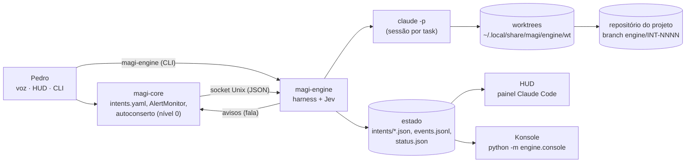
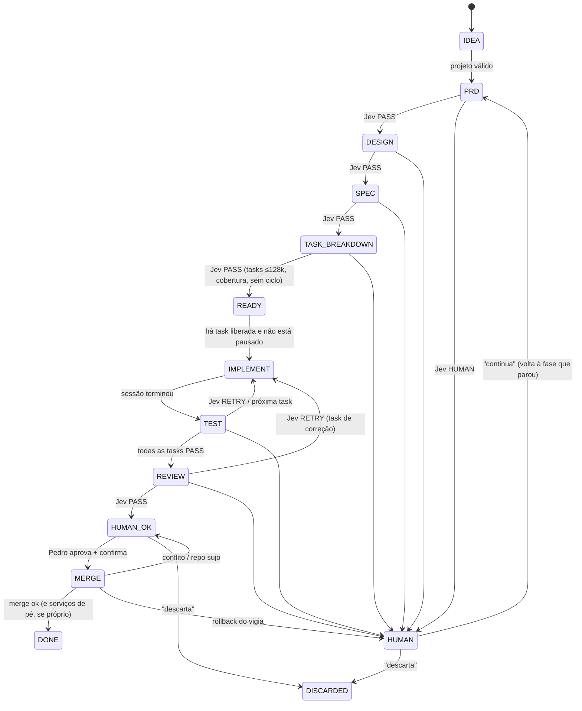

# Design — Condessa Engine

Implementa [requirements.md](requirements.md). Contratos exatos, schemas e casos de borda em
[spec.md](spec.md). Fonte: PDF *Condessa Engine – Arquitetura de Desenvolvimento* + decisões D1–D10.

## 1. Visão geral

Um serviço novo (`magi-engine`, systemd `--user`) com o harness, mais o que já existe: `magi-core`
(voz), o HUD (painel "Claude Code") e o Claude Code instalado. O Engine não chama LLM direto: todo
trabalho de modelo é uma sessão `claude -p` descartável.



| Processo | Papel | Fica ligado? |
| --- | --- | --- |
| `magi-engine` | Harness: fila de intenções, máquina de estados, montagem de contexto, sessões, gates, Jev, merge | Sempre, ocioso em `await` |
| `claude -p` | Agente descartável: escreve um artefato, implementa uma task ou revisa | Só durante a task |
| `magi-core` | Recebe a voz, encaminha pedidos ao Engine pelo socket e fala os avisos | Já existe |
| HUD | Lê `status.json` e mostra no painel "Claude Code" | Já existe |
| Console | `python -m engine.console` dentro do Konsole; só lê o estado | Enquanto a janela estiver aberta |

**Por que um serviço separado do `magi-core`:** um merge da própria Condessa reinicia o `magi-core`;
o Engine (que comanda o merge) não pode morrer junto. O vigia de rollback continua sendo um
`systemd-run` à parte, como no autoconserto.

## 2. Stack

| Camada | Escolha | Observação |
| --- | --- | --- |
| Linguagem | Python 3.12 do venv do projeto (`uv`) | Pacote `engine/` na raiz, ao lado de `magi/` |
| Async | `asyncio` | Um loop; sessões são subprocessos |
| Estado | JSON por intenção + `events.jsonl` (escrita atômica, como o `autofix`) | RNF-09: sem banco novo |
| Artefatos | Markdown com cabeçalho YAML (`pyyaml`, já no projeto) | O Jev lê só o cabeçalho |
| Config de projeto | TOML (`tomllib`) | `engine/validation/projects/<nome>.toml` |
| Executor | `claude -p --output-format stream-json --verbose` | Consumo lido do fluxo (validar no S-E1) |
| Git | `git` por subprocesso (worktree, diff `--numstat`, merge, blame) | Sem libgit |
| Console | `konsole` por linha de comando | Sem D-Bus (D6) |
| IPC | Socket Unix `$XDG_RUNTIME_DIR/magi-engine.sock`, JSON por linha | Mesmo padrão do HUD |

## 3. Estrutura de `engine/` (D3, PDF p.3)

```
engine/
├── __init__.py
├── contracts.py          # dataclasses e enums compartilhados (estados, veredito, task, evento)
├── sdd/
│   ├── schema.py         # leitura e validação estrutural dos artefatos
│   ├── templates/        # esqueleto de cada artefato (vai no prompt do agente)
│   ├── prd/              # INT-NNNN-<slug>.md           (artefatos persistentes)
│   ├── design/
│   ├── specs/
│   └── tasks/
├── agents/               # prompts e montagem da linha de comando de cada papel
│   ├── spec_writer.py    # PRD, Design, Spec, Tasks, divisão de task
│   ├── implementer.py
│   └── reviewer.py
├── harness/
│   ├── machine.py        # máquina de estados (transições e critérios de entrada)
│   ├── orchestrator.py   # loop, fila, paralelismo, pausas (jogo, cota)
│   ├── runner.py         # sessão claude -p + monitor de tokens
│   ├── gitops.py         # branches, worktrees, diff, merge, trailers
│   ├── merge.py          # merge pessoal e próprio (reusa o vigia do autofix)
│   ├── service.py        # magi-engine: socket, avisos ao magi-core
│   └── cli.py            # magi-engine open|status|approve|discard|continue|why|console
├── context/
│   └── builder.py        # pacote de contexto por blocos com orçamento
├── decisions/            # Jev
│   ├── jev.py            # avalia regras → veredito
│   ├── rules_sdd.py      # regras das fases PRD/DESIGN/SPEC/TASKS
│   └── rules_impl.py     # regras de implementação e revisão
├── tools/
│   └── tokens.py         # estimativa de tokens por bytes
├── validation/
│   ├── gates.py          # roda lint/test/build do projeto, normaliza o resultado
│   ├── projects.py       # leitura do arquivo de projeto + recusa Sume/GitLab
│   └── projects/         # condessa.toml, <pessoal>.toml
├── memory/
│   └── ledger.py         # decisões técnicas e falhas por projeto
└── console/
    ├── view.py           # visão ao vivo (texto ANSI, sem dependência nova)
    └── launch.py         # abre o Konsole (forma validada no S-E2)
```

Dados de execução **fora do git** em `~/.local/share/magi/engine/` (§12). Artefatos SDD **dentro do
git**, no branch da intenção (§9), para virem no mesmo merge do código (R4.2).

## 4. Máquina de estados (R5)



PAUSED é um estado transversal (jogo aberto não pausa — só segura novas sessões; PAUSED é para
cota estourada, `magi-engine pause` ou erro de infraestrutura) e guarda o estado a que volta. Cada
task tem a própria máquina: `PENDING → RUNNING → CHECKING → PASS | RETRY → … | HUMAN | SPLIT`.

A intenção fica em IMPLEMENT/TEST enquanto houver tasks; o estado mostrado é o da intenção, e a
lista de tasks vem junto no `status.json`.

## 5. Harness (orquestrador)

Loop único (`orchestrator.py`), acordado por evento (pedido no socket, fim de sessão) ou a cada 30 s:

1. Para cada intenção não terminal, pede à máquina a **próxima ação** (gerar artefato, liberar
   task, rodar gates, revisar, avisar, fazer merge).
2. Antes de abrir sessão: `busy()` (jogo aberto, mesma checagem do autoconserto) → espera;
   cota pausada → espera; vagas `max_parallel` → espera.
3. Abre a sessão (§6–§7), acompanha (§8), coleta resultado, roda gates (§10), chama o Jev (§11),
   aplica o veredito e grava a transição.
4. Grava `status.json` a cada mudança (HUD e console leem só ele e o `events.jsonl`).

Ordem entre intenções: FIFO por criação; intenções `conserto` passam à frente. Dentro de uma
intenção, tasks liberadas por ordem topológica.

## 6. Agentes (D1)

Três papéis, todos `claude -p` com o prompt entrando por stdin e o pacote de contexto como bloco de
dados. Flags exatas e listas de ferramentas em spec §4.

| Papel | Onde roda | Permissão | Saída |
| --- | --- | --- | --- |
| Escritor de spec (PRD, Design, Spec, Tasks, divisão) | worktree da intenção | `acceptEdits`, mas `Edit/Write` só em `engine/sdd/**` (checado pelo Jev no diff) + leitura do projeto | 1 arquivo de artefato |
| Implementador | worktree da task | `acceptEdits`, edição + gates do projeto + `git add/commit` | commits no branch da task |
| Revisor | worktree da intenção | `plan` (só leitura) | JSON de achados no stdout |

O escritor de spec lê o repositório do projeto (só leitura) para ancorar o design no código real; a
saída é sempre um único arquivo, e o Jev recusa diff fora dele.

Modelo padrão `sonnet` (como o autoconserto), configurável por papel em `[engine.models]`.

## 7. Pacote de contexto (R7, PDF p.2)

`context/builder.py` monta um Markdown com blocos marcados (`<BLOCO nome="spec">…</BLOCO>`), cada um
limitado pela tabela do PDF (ponto de partida, configurável em `[engine.budget]`):

| Bloco | Limite | Fonte |
| --- | --- | --- |
| instruções e regras | 8k | template do papel + regras fixas (caminhos proibidos, sem push) |
| PRD | 8k | objetivo + requisitos referenciados pela task (via spec → design → R) |
| design | 12k | componentes referenciados |
| spec | 15k | itens referenciados (contratos, schemas, bordas, critérios) |
| decisões anteriores | 5k | `memory/ledger.py` (R17) |
| código | 45k | arquivos `reads` + `writes` da task |
| testes | 15k | testes declarados + `tests/` espelhando os `writes` |
| task | 5k | a própria task |
| reserva de saída | 15k | não é montado; é o espaço da sessão |

Tokens estimados pela regra do repositório: 1k ≈ 3,5 KB de texto em português, ≈ 4 KB de código
(`tools/tokens.py`). Bloco acima do limite é cortado com `[… cortado: N tokens …]`, **exceto** o
bloco de código: passou de 45k, a task é grande demais e o Jev a recusa já no TASK_BREAKDOWN, onde a
mesma estimativa é calculada (R6.4). O pacote é gravado em `runs/<INT>/<T>/<n>/context.md`.

O pacote é o **início** da sessão; o agente pode ler mais (o orçamento é monitorado, não imposto —
D7). A instrução diz para não sair lendo o repositório e para parar se o pacote não bastar,
igual às regras do `specs/magi-assistant/tasks.md`.

## 8. Monitor de tokens (R9, D7)

`runner.py` lê o stdout em `stream-json`: cada mensagem `assistant` traz `message.usage`. Ocupação
= `input_tokens + cache_read_input_tokens + cache_creation_input_tokens + output_tokens` da última
resposta (é o tamanho do contexto naquele turno, não a soma). Consumo = soma dos tokens novos
(como `claude_usage.Tokens.fresh`) e da leitura de cache, separados.

- ≥ 85%: evento `budget_warn` (console).
- > 128k, ou evento de compactação de contexto: SIGTERM no grupo do processo, 10 s, SIGKILL;
  resultado `OVER_BUDGET`.
- Fallback (se o S-E1 mostrar que o fluxo não traz `usage`): passar `--session-id` e ler o
  `~/.claude/projects/<pasta>/<sessão>.jsonl` com o leitor incremental de `claude_usage.py`.

As sessões do Engine já aparecem sozinhas na janela de 5 h do painel, porque gravam nos mesmos
registros que o `UsageReader` lê (D1).

## 9. Git: branches, worktrees e merge (R8, R12, R13)

- Branch da intenção: `engine/INT-NNNN` a partir do ramo principal do projeto, numa worktree em
  `wt/INT-NNNN/main`. Os artefatos SDD são commitados nele (projeto próprio) — ver pergunta P3 para
  projetos pessoais.
- Branch da task: `engine/INT-NNNN/T003` a partir do branch da intenção, worktree `wt/INT-NNNN/T003`.
  PASS → merge local `--no-ff` da task no branch da intenção (automático: não é o merge do Pedro).
  Tasks paralelas que conflitam no merge interno → a segunda volta a PENDING rebaseada (1 vez) e,
  se conflitar de novo, HUMAN.
- Diff da task: `git diff --numstat <base>...HEAD` + `--name-status` (renomes contam nos dois nomes).
- Commit: o agente commita; o harness confere e, se faltar, acrescenta os trailers por
  `git commit --amend` só no último commit da task (spec §7).
- Merge do Pedro: §10 do spec. Projeto próprio reusa `magi.maintenance.autofix.guard` por
  `systemd-run --user` (o vigia que já existe), com a lista de serviços afetados derivada dos
  caminhos tocados (mapa no arquivo de projeto).
- Limpeza: worktrees apagadas em DONE/DISCARDED; branches mantidos (rastreabilidade).

## 10. Validação (gates)

`validation/gates.py` roda, na worktree, os comandos do arquivo de projeto (lista de argumentos, sem
shell), cada um com tempo limite, e devolve `GateResult(nome, código, duração, cauda)` com a cauda da
saída cortada (40 linhas, 300 colunas, como `autofix.sanitize`). A **assinatura de falha** é um hash
do nome do gate + linhas de erro normalizadas (sem números de linha, caminhos temporários e
horários), usada pelo Jev para detectar loop.

## 11. Jev (`engine/decisions/`)

Função pura: `decide(fase, evidência, histórico) -> Verdict`. Sem rede, sem LLM, sem relógio (o
horário vem na evidência). Regras numeradas (spec §6), avaliadas em ordem; a primeira que manda
HUMAN vence; senão, qualquer falha → RETRY (respeitando os limites de loop e de tentativas); senão
PASS. O veredito traz a lista completa de falhas, que vira a seção "o que corrigir" do próximo
pacote de contexto.

"Jev na camada de ferramentas" (PDF p.2): nesta versão o controle de ferramentas é feito por
`--allowedTools`/`--disallowedTools` e checado depois no diff; um hook `PreToolUse` que consulte o
Jev em tempo real fica como pergunta P2.

## 12. Dados em disco

`~/.local/share/magi/engine/`:

```
status.json            # resumo para HUD e console (spec §8)
intents/INT-0007.json  # estado completo da intenção e das tasks (spec §3)
events.jsonl           # log de eventos, só cresce (spec §9); gira em 10 MB
runs/INT-0007/T003/2/  # context.md, prompt.md, stream.jsonl, gates.json, verdict.json
wt/INT-0007/...        # worktrees
ledger/<projeto>.jsonl # memória de decisões e falhas (R17)
counter                # último número de intenção
```

## 13. Console no Konsole (R14, D6)

`console/launch.py` abre **uma** janela com o comando validado no S-E2 (candidato:
`konsole --separate -p tabtitle=Condessa\ Engine -e <venv>/bin/python -m engine.console`), guarda o
PID e não abre outra se ele estiver vivo. `console/view.py` redesenha a cada 1 s a partir do
`status.json` e mostra as últimas linhas do `events.jsonl` (fase, task, ocupação em barra, vereditos).
Proibido: `qdbus`/`gdbus` para `org.kde.kglobalaccel` ou `org.kde.KWin`; qualquer D-Bus de escrita
para o Konsole que não esteja no `docs/spikes/SE2.md`.

## 14. HUD e voz (R15, D9)

- HUD: `ClaudeStats` (`hud/wired/data.py`) ganha a leitura do `status.json` do Engine
  (`ClaudeView.engine`); a linha do autoconserto passa a vir de lá. O painel mostra até 3 intenções
  (ID curto, fase, task, ocupação) e um destaque "aguardando seu ok" quando houver HUMAN_OK.
- Voz: novas intenções em `magi/core/intents.yaml` (`engine.open`, `engine.approve`,
  `engine.discard`, `engine.status`, `engine.pending`, `engine.continue`) com ação em
  `magi/core/actions/engine.py`, que fala com o socket. "aprova o merge" usa a confirmação falada
  que já existe para ações perigosas ("diz confirma", 8 s).
- Avisos do Engine ao `magi-core` pelo mesmo socket (mensagem `say`), com a regra "uma vez por
  mudança de estado".

## 15. Autoconserto (R16, D10)

`Autofix.start_fix` passa a abrir uma intenção `tipo = "conserto"` no projeto próprio (texto = o
diagnóstico, marcado como dados). PRD e Design de conserto são curtos (template próprio: 1 requisito
"o serviço X volta a funcionar" com critério verificável, design "sem mudança de arquitetura"), mas
passam pelo Jev igual. `apply`/`discard`/`status` viram chamadas a approve/discard/status da
intenção de conserto aberta. O limite de 3 sessões por dia do autoconserto vira o limite do Engine
para intenções `conserto`. O vigia `guard` continua no `autofix.py` e é reusado pelo merge.

## 16. Erros e degradação

| Falha | Comportamento |
| --- | --- |
| `claude` ausente ou não logado | intenção vai para PAUSED com motivo; aviso por voz uma vez |
| Limite de uso da assinatura | PAUSED até o fim da janela de 5 h (`claude_usage.current_window`) |
| Engine reinicia no meio de uma sessão | sessão órfã morta pelo grupo de processo; conta como falha (R10.9) |
| `magi-core` fora | Engine segue; avisos ficam pendentes e saem quando ele voltar |
| Konsole não abre | evento de erro; Engine segue |
| Disco cheio / git falha | PAUSED com motivo; nada é apagado |

## 17. Testes

- Jev, schema e builder: testes puros com artefatos de exemplo em `tests/engine/fixtures/`.
- Runner: `claude` falso (script que emite `stream-json` gravado no S-E1), inclusive estouro e
  compactação.
- Git e merge: repositório temporário (`tmp_path`), nunca o repositório real; vigia com
  `systemctl` falso.
- Console: nunca abre Konsole nos testes (`MAGI_ENGINE_NO_CONSOLE=1`); `launch` testado com
  `subprocess` falso conferindo o argv exato.
- Ponta a ponta: projeto de brinquedo + `claude` falso, IDEA → DONE.

## 18. Spikes antes da implementação

| Spike | Pergunta | Saída |
| --- | --- | --- |
| S-E1 Claude Code headless | `stream-json` traz `usage` por resposta? `--session-id` existe na versão instalada? como aparece compactação e limite de uso? matar o grupo encerra limpo? | `docs/spikes/SE1.md` + amostras gravadas para o `claude` falso |
| S-E2 Konsole | Abrir janela/aba a partir de um serviço `systemd --user` (variáveis `WAYLAND_DISPLAY`/`DISPLAY`), `--new-tab` vs `--separate`, sem D-Bus | `docs/spikes/SE2.md` com o comando aprovado |

## 19. Riscos

| Risco | Efeito | Mitigação |
| --- | --- | --- |
| O Engine altera o próprio Jev para passar | perde o freio | `engine/` proibido para origem `condessa`; mudança em `engine/decisions/**` ou `engine/validation/**` sempre HUMAN antes da revisão (spec J-I05) |
| Injeção de instrução via log, intenção ou código lido | agente faz algo fora da task | texto externo sempre em bloco de dados; ferramentas restritas; diff checado depois |
| Jev rígido demais | muitas intenções em HUMAN | limites configuráveis; histórico mostra qual regra mais trava |
| Consumo da assinatura | janela de 5 h some e atrapalha o uso manual | `max_parallel = 1`, sessões só fora de jogo, consumo visível no HUD; pergunta P5 |
| Merge da Condessa derruba a voz | ela não consegue avisar | vigia separado com `git revert`; Engine em serviço próprio |
| Konsole/D-Bus derruba a sessão KDE | perde a sessão inteira | só linha de comando validada no S-E2; testes sem Konsole |
| Estimativa de tokens errada | task estoura na prática | monitor encerra; RETRY com divisão |
| Branch da intenção desatualizado em relação ao principal | conflito no merge | merge mostra conflito e fica em HUMAN_OK; pergunta P8 |
| Projeto da empresa entra por engano | violação de regra fixa | recusa por caminho e remoto, checada antes de qualquer leitura, testada |

## 20. Decisões do Pedro (2026-10-07) sobre as perguntas em aberto

| Pergunta | Decisão |
| --- | --- |
| P1 PRD em intenções grandes | **Não** revisa: aprovação só no merge, sempre (D2). |
| P2 Jev na camada de ferramentas | **Ao vivo:** hook `PreToolUse` do Claude Code veta na hora caminho proibido e comando fora da lista (nova task E2.7, depois de E2.5); o diff continua conferido no fim. |
| P3 Artefatos de projetos pessoais | Padrão: em `engine/sdd/` deste repositório. |
| P4 REVIEW | Padrão: agente revisor só de leitura; o Jev consolida. |
| P5 Cota | **Autoimplementação: 3 sessões por janela de 5 h** (`max_sessions_per_window = 3` para o projeto `condessa`). **Se o VS Code estiver aberto** (processo `code`/`codium` do usuário), o Engine **pergunta antes** de abrir sessão (voz + HUD) e só segue com "pode". |
| P6 Tamanho de diff | Padrão: 400 linhas e 10 arquivos por task. |
| P7 Merge em projeto pessoal | Padrão: só merge local, sem push/PR automático. |
| P8 Ramo principal andou | Padrão: só avisa o conflito no merge (sem rebase automático). |
| P9 Propostas da Condessa | **Seguem sozinhas** até o merge, no máximo 1 aberta por vez e 2 por semana. |
| P10 Teto de 128k | Padrão: ocupação do contexto. |
| P11 `deploy/**`, `hud/system/**` | Padrão: proibidos para o projeto próprio. |

## 21. Perguntas em aberto (histórico)


Registradas aqui em vez de decididas por conta própria (o PDF não responde):

- **P1 — Quem escreve PRD/Design/Spec?** O PDF diz que o "modelo de especificação" gera as tasks,
  mas não quem escreve o PRD a partir da intenção. Este design usa o Claude Code (papel escritor de
  spec). O Pedro quer revisar o PRD antes de seguir em intenções grandes, apesar de D2?
- **P2 — Jev "na camada de ferramentas":** o PDF diz que o Jev atua também na camada de ferramentas.
  Basta `--allowedTools` + checagem do diff, ou o Jev deve vetar chamadas ao vivo com hook
  `PreToolUse`?
- **P3 — Onde ficam os artefatos de projetos pessoais?** Neste repositório (`engine/sdd/`, como o
  PDF desenha) num branch `engine/INT-NNNN` do Magi, mesclado junto no ok, ou dentro do repositório
  do próprio projeto (ex.: `specs/`)? O design assume o primeiro, que exige dois merges no mesmo ok.
- **P4 — Quem faz o REVIEW?** O PDF põe REVIEW antes do HUMAN OK sem dizer se é agente ou regra. O
  design usa um agente revisor só de leitura cujo resultado o Jev consolida.
- **P5 — Limite de consumo:** quantas sessões por janela de 5 h / por dia o Engine pode usar da
  assinatura? (o autoconserto usa 3 por dia; o design propõe `max_sessions_per_window = 6`).
- **P6 — Tamanho máximo de diff por task:** D8 pede o limite mas não o valor; proposto 400 linhas
  (+/-) e 10 arquivos, configurável por projeto.
- **P7 — "PR/merge local":** em projetos pessoais, "PR" quer dizer abrir PR no GitHub (exige push,
  que D4 proíbe automático) ou só merge local? O design faz só merge local e deixa o push para o
  Pedro.
- **P8 — Intenção longa e ramo principal andando:** rebase automático do branch da intenção antes
  do REVIEW, ou só avisar o conflito no merge?
- **P9 — Propostas da Condessa entram sozinhas?** D2 diz aprovação só no merge; D5 diz que ela
  "propõe". O design deixa a proposta seguir sozinha (com limites do R2.4) e o Pedro pode
  descartar. Ou ela deve esperar um "pode seguir"?
- **P10 — Ocupação ou soma?** O teto de 128k vale para a ocupação do contexto (adotado) ou para a
  soma de tokens da sessão inteira?
- **P11 — Caminhos proibidos do projeto próprio:** além da lista fixa, `deploy/**` e
  `hud/system/**` (unidades systemd e Docker do repositório) entram como proibidos? Proposto: sim.
