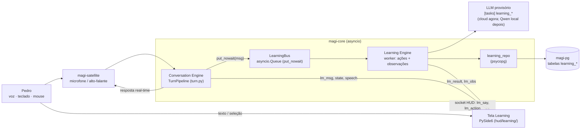

# Design — Condessa Learning Mode

Implementa [requirements.md](requirements.md). Contratos exatos, schemas e casos de borda em
[spec.md](spec.md). Fonte: PDF *Condessa Learning Mode – Living Specification* + mockup de
2026-10-07. Onde o PDF e o sistema real divergem, a divergência está em §16 (perguntas em aberto)
com uma proposta, **sem decisão irreversível tomada aqui**.

## 1. Visão geral

O Learning Mode não é um serviço novo: é **uma superfície nova (tela) + um worker assíncrono dentro
do `magi-core`**, reusando o que já existe — pipeline de turno, STT/TTS, socket do HUD, providers,
orçamento e Postgres.



| Peça | Onde | Papel | Novo? |
| --- | --- | --- | --- |
| Conversation Engine | `magi/core/turn.py` | Responde (voz e agora texto). Só ganha um gancho `publish()` | Gancho novo, pipeline igual |
| LearningBus | `magi/learning/bus.py` | Fila em memória; `put_nowait`, nunca bloqueia | Novo |
| Learning Engine | `magi/learning/engine.py` | Worker: executa ações pedidas e gera observações | Novo |
| Analisadores | `magi/learning/analyzers/*.py` | Prompt + parser por ação; trocáveis (ENG-002) | Novo |
| learning_repo | `magi/learning/repo.py` | CRUD das tabelas `learning_*` | Novo |
| Tela Learning | `hud/learning/` | Janela PySide6 com o tema wired (P1) | Novo |
| Socket HUD | `magi/core/hud_client.py`, `magi/common/contracts.py` | Ganha mensagens `lm_*` | Mensagens novas |

**Por que dentro do `magi-core` e não serviço próprio:** o núcleo já tem providers, orçamento
(`budget.py`, tabela `costs`), pool do banco e o socket do HUD. Um serviço separado duplicaria
tudo isso. O isolamento de latência (ENG-001) vem da fila + tarefa separada + limite de
concorrência, não do processo. Se medição mostrar interferência (RNF-01), o worker sai para um
processo à parte sem mudar o contrato (é o mesmo `LearningBus` com outro transporte).

## 2. Stack

| Camada | Escolha | Motivo |
| --- | --- | --- |
| UI | PySide6, widgets reais (`QTextBrowser`/`QPlainTextEdit` só leitura) + pintura do tema wired | Seleção de texto nativa; o HUD atual é QPainter puro (sem seleção) — ver §16 P1 |
| Tema | `hud/wired/theme.py`, `kit.py`, `fonts.py`, `mascot.py` | Reuso (PDF §13 "Reuse"; PDF §12 proíbe redesign) |
| Transporte UI↔núcleo | socket Unix do HUD já existente (JSON por linha) | Já tem reconexão, último `state`, etc. |
| Worker | `asyncio.Task` + `asyncio.Queue` + `Semaphore(1)` | Sem dependência nova |
| LLM | interface `LearningModel` sobre os providers existentes | ENG-002 |
| Banco | `magi-pg` (Postgres 16 + pgvector instalado), migração `003_learning.sql` | DAT-001; sem `vector` (DAT-003) |

## 3. Estrutura de arquivos

```
magi/learning/
  __init__.py
  contracts.py      # LearningMessage, Selection, ActionRequest, ActionResult, Observation, enums
  bus.py            # LearningBus (fila limitada, put_nowait, descarte do mais antigo)
  engine.py         # LearningEngine: loop, prioridades, gate de estado (THINKING/SPEAKING)
  model.py          # LearningModel (protocolo) + OpenAIModel provisório + FakeModel (testes)
  analyzers/
    improve.py  explain.py  translate.py  vocabulary.py  observe.py
  prompts/          # *.md com os prompts (texto do usuário sempre em bloco de dados)
  repo.py           # learning_sessions/messages/observations/action_results
  session.py        # ciclo de sessão (start/end/inatividade), IDs LS-
magi/memory/migrations/003_learning.sql
hud/learning/
  __main__.py       # python -m hud.learning (janela própria; P1)
  window.py         # layout de 3 colunas + barra de topo/rodapé
  conversation.py   # histórico selecionável + entrada de texto + legenda sincronizada
  selection_menu.py # menu flutuante (SEL-*)
  bubble.py         # balão de resultado por ação
  observations.py   # indicador OBSERVATIONS [nn] + drawer
  condessa_panel.py # retrato + estado + nível
  system_panel.py   # MAGI SYSTEM recolhível (SYS-*)
  client.py         # cliente do socket HUD (lm_*)
tests/learning/
```

## 4. Layout da tela (referência visual: mockup)

O mockup é **referência de hierarquia, não pixel** (PDF §4). Composição em três colunas sob uma
barra de topo, com rodapé fino:

```
┌──────────────────────────────────────────────────────────────────────────────┐
│ 汎用学習システム / GENERAL PURPOSE LEARNING SYSTEM · MAGI-01                     │
│        私は、ここにいる。 // I AM HERE · LEARNING MODE ACTIVE        QUA 07 OUT 17:42 │
├──────────────┬──────────────────────────────────────────┬────────────────────┤
│ MAGI SYSTEM  │ ENGLISH SESSION // CONVERSATION 01        │ MAGI-01 // CONDESSA│
│ Melchior     │                                          │  [retrato]         │
│ Balthasar    │ CONDESSA  How was your day today?        │  TEACHING 教育中 ●  │
│ Casper       │ YOU       It was pretty good… [I make]…  │  B2                │
│ (recolhível) │             └ menu: selected "I make"    │  CONVERSATION      │
│──────────────│                 ✦ Improve  ? Explain      ├────────────────────┤
│ ENGLISH //   │                 ⇄ Translate ◇ Vocabulary  │ OBSERVATIONS [03] ▾│
│ B2·CONVERS.  │                       └ balão Improve ───►│  (drawer: vocab,   │
│ SPEAKING ●   │ CONDESSA  Oh, nice. What kind of …?      │   grammar,         │
│ LISTENING ●  │                                          │   recurring)       │
│ [mic]        │ ─ AUDIO CAPTURE // INPUT ~~~~~~~~~~~~~~~ │ [VIEW LEARNING     │
│ NETWORK      │ > type a message…            STATUS ●    │  PROFILE] (desab.) │
├──────────────┴──────────────────────────────────────────┴────────────────────┤
│ MAGI · MULTI AGENT GUIDANCE INTERFACE   [19:30:44] english session active: 01  LEARNING MODE │
└──────────────────────────────────────────────────────────────────────────────┘
```

| Região | Conteúdo | Prioridade (PRN-001) |
| --- | --- | --- |
| Centro (≈ 50–55% da largura) | Cabeçalho da sessão; histórico (rótulo `CONDESSA` em lilás `CPU #b392f0`, `YOU` em `TEXT_DIM`, texto em `TEXT`); onda de áudio; status; **campo de texto** (acréscimo LM-001, ausente no mockup) | Primária |
| Direita (≈ 20%) | Retrato da Condessa, estado (`TEACHING`, `LISTENING`…), nível `B2 / CONVERSATION`; abaixo, `OBSERVATIONS [03]` recolhível; botão Learning Profile | Secundária |
| Esquerda (≈ 20%) | MAGI SYSTEM (Melchior/Balthasar/Casper, recolhível a uma linha), bloco de sessão (`ENGLISH // B2 · CONVERSATION`, `SPEAKING ● ACTIVE`, `LISTENING ● READY`, mic com nível), NETWORK | Secundária, `TEXT_DIM` (SYS-001) |
| Topo / rodapé | Título japonês + inglês, frase "私は、ここにいる。", data/hora; rodapé com log de uma linha | Decorativa |

**Ultrawide (RNF-06):** em 3440×1440 a coluna central fica limitada a ~110 caracteres por linha
(legibilidade) e centralizada; a sobra vai para margens das colunas laterais, não para esticar o
texto. Cantos superiores ficam sem elementos críticos (preferência registrada do Pedro).
Tema: paleta do wired (roxo Catppuccin/Eva), sem animação piscante, brilho só em linhas.

**Menu e balão (SEL-002):** o menu é um popup pequeno ancorado no fim da seleção (como no mockup:
`selected: "I make"` + quatro itens com ícones ✦ ? ⇄ ◇). O balão de resultado abre ao lado do menu,
**sobrepondo a borda entre conversa e coluna direita** se faltar espaço, nunca cobrindo a mensagem
selecionada. O destaque da seleção (fundo lilás translúcido) permanece enquanto o balão estiver
aberto.

## 5. Conversa por texto e voz (LM-001..LM-003)

- **Voz:** nada muda no caminho do áudio. No fim do turno, o núcleo emite `lm_msg` para o Pedro
  (`text = transcript.heard`, LM-002 — o `Corrector` pode ter alterado `final`, e o Improve precisa
  do que ele realmente disse) e para a Condessa (`text = result.speech` completo).
- **Texto:** a tela manda `{"t":"lm_say","text":…}`; o núcleo monta `Transcript.raw(text)` e chama
  o mesmo `TurnPipeline.respond`, sem STT. Se "falar resposta" estiver ligado, a resposta vai ao
  TTS como sempre; senão, só texto.
- **Legenda sincronizada (LM-003):** a mensagem da Condessa entra no histórico como "em fala" e é
  revelada usando `speech_caption.py` (mesmos `speech`/`dur`); quando a fala acaba vira texto fixo
  selecionável. Seleção fica desabilitada na mensagem em fala.
- **Persona:** ao entrar no modo, o núcleo acrescenta ao prompt do agente um bloco "Learning Mode"
  (conversa natural em en-GB, perguntas abertas, sem correção explícita — CNV-002). Não troca o
  modelo do agente (`gpt-5.4-mini`).

## 6. Learning Engine (ENG-001, ENG-002)

```
TurnPipeline ──publish(msg)──► LearningBus (Queue maxsize=50) ──► LearningEngine.loop
UI ──lm_action──► LearningEngine.request(action) ─(fila de prioridade alta)─┘
```

- `publish` é síncrono, `put_nowait`; fila cheia descarta o mais antigo (ENG-001 §3). O gancho fica
  **depois** de a resposta ser entregue ao TTS/HUD, nunca antes.
- Duas filas: **ações** (pedidas pelo Pedro, prioridade alta) e **observações** (background).
  `Semaphore(1)` para chamadas de modelo: no máximo uma chamada do Learning Engine por vez.
- Gate de estado: observações só começam com o núcleo em `LISTENING`/`SLEEPING`/`FOLLOWUP`
  (nunca `THINKING`/`SPEAKING`); ações podem rodar sempre (o Pedro pediu).
- Observação em lote: a cada mensagem do Pedro, uma chamada com a mensagem + as 2 anteriores de
  contexto, devolvendo 0..N observações (JSON). Mensagens da Condessa não geram observação.
- Cada analisador = prompt em `prompts/*.md` + schema de saída + parser tolerante; JSON inválido →
  1 nova tentativa → erro (LM-007).
- Cache: mesma ação + mesmo trecho + mesma mensagem → devolve o `learning_action_results` salvo.

### Modelo (P2)

| Uso | Direção do PDF | Provisório (MVP) | Config |
| --- | --- | --- | --- |
| Ações | não especificado | OpenAI `gpt-5.4-mini`, `reasoning_effort = "none"`, timeout 8 s | `[tasks] learning_actions` |
| Observações | Qwen local | OpenAI `gpt-5.4-mini` (ou um modelo menor da mesma família, se houver) com batch por mensagem | `[tasks] learning_observe` |
| Futuro | Qwen local (Ollama/llama.cpp) | provider `ollama` novo, mesmo protocolo `LearningModel` | só trocar a linha |

Não há LLM local instalado hoje; instalar Qwen é decisão do Pedro (P2). O protocolo
`LearningModel.complete(prompt, schema) -> dict` isola isso.

## 7. Estado da Condessa na tela (UI-001)

Mapeamento do estado do núcleo (`StateMsg`) para o rótulo do painel — tabela exata em spec §7.
`TEACHING` é o rótulo de repouso do Learning Mode (núcleo ocioso com sessão ativa), substituindo
"idle"; `LISTENING`, `THINKING`, `SPEAKING` seguem o núcleo; `ANALYZING` (discreto) quando uma ação
pedida está rodando.

## 8. Persistência (DAT-*)

Mínimo para o MVP, por migração aditiva `003_learning.sql` no schema `public` do `magi-pg`, prefixo
`learning_` (as tabelas `corrections`, `vocab` e `progress` já existem e têm outro sentido: STT e
franquias). DDL em spec §8.

| Tabela | Para quê | Entidade do PDF (DAT-002) |
| --- | --- | --- |
| `learning_sessions` | uma linha por sessão (início, fim, nível exibido) | sessions |
| `learning_messages` | histórico (autor, texto, origem voz/texto, `heard`) | messages |
| `learning_observations` | achados do background (`category`, `rule_key`, trecho, sugestão) | observations (+ base de corrections/grammar_patterns) |
| `learning_action_results` | cache/registro das ações | — (apoio) |

Fica para a Fase 5 (FUTURE): `users`, `vocabulary`, `grammar_patterns`, `learning_progress`
como tabelas próprias. Sem `vector` (DAT-003); MEM-001 poderá começar por `rule_key` sem
embeddings. **Nunca** `DROP`, `docker compose down` ou `docker rm` no `magi-pg` (LM-010); testes
usam schema próprio pelo `migrate.py --schema`.

**Alternativa provisória** (se o Pedro preferir não tocar no banco antes da Fase 5): o mesmo
`repo.py` com backend JSONL em `~/.local/share/magi/learning/`. O contrato do repo é o mesmo; a
escolha é uma linha de config (P4).

## 9. Socket HUD (mensagens `lm_*`)

Novas mensagens no padrão de `magi/common/contracts.py` (JSON de uma linha, campo `t`):
`lm_mode`, `lm_say`, `lm_msg`, `lm_action`, `lm_result`, `lm_obs`, `lm_session`. Formatos em
spec §6. Atenção: `decode_hud` (`magi/common/events.py`) **levanta `HudDecodeError` para tipo desconhecido**;
antes de emitir `lm_*` é preciso confirmar que o cliente do `gamerhud` registra e ignora o erro
(sem derrubar a conexão) ou enviar `lm_*` só ao cliente que se anunciou como Learning (task LM1.2).

## 10. Entrada e saída do modo (LM-005)

- Entrar: voz ("Condessa, learning mode" / "modo de estudo"), comando `magi learning` ou botão no
  HUD → núcleo cria sessão, manda `lm_mode on`, a janela abre (`python -m hud.learning`).
- Sair: voz ("end session"), botão "end" ou 20 min sem mensagem → `lm_mode off`, sessão fechada.
- Fora do modo, nada de `lm_*` é publicado e o `LearningBus` fica parado (custo zero).
- O HUD wired (`gamerhud.py`) continua igual; o modo não substitui a tela principal.

## 11. Observações na UI (OBS-*)

Indicador `OBSERVATIONS [03] ▾` no topo da coluna direita (abaixo do retrato), recolhido por
padrão. Expandido vira um drawer na própria coluna com três grupos: **VOCABULARY** (palavras novas
ou bem usadas, ex.: `+ repository`, `+ deploy`), **GRAMMAR** (ex.: `Past tense`), **RECURRING**
(ex.: `Prepositions`, 2+ na sessão). Clicar num item rola o histórico até a mensagem e pisca o
destaque uma vez (sem animação contínua).

## 12. Erros e degradação

| Situação | Comportamento |
| --- | --- |
| Modelo das ações fora/timeout | balão "couldn't reach the tutor · retry" (LM-007) |
| Orçamento estourado | balão "monthly budget reached"; observações pausam (LM-006) |
| Banco fora | sessão segue em memória; aviso no rodapé; grava quando voltar (até 500 mensagens) |
| Núcleo fora | janela mostra `STATUS // DISCONNECTED`, entrada desabilitada, histórico local fica |
| Fila de observações cheia | descarta a mais antiga, contador de descartes no log |

## 13. Testes

- Unidade com `FakeModel` (respostas gravadas) para cada analisador e para o engine.
- Teste de latência: turno falso com engine ligado vs. desligado, 200 rodadas, p95 (RNF-01).
- Repo contra schema de teste (`migrate.py --schema learning_test`), nunca `public`.
- UI: o projeto não tem `pytest-qt`; a lógica pura separada (posição do menu,
  recorte de seleção, agrupamento de observações) testada sem Qt, como `hud/wired/integration.py`.

## 14. Fases (roadmap do PDF §14)

| Fase | Conteúdo | MVP? |
| --- | --- | --- |
| 1 | Tela core e hierarquia visual (conversa primeiro), texto + voz no histórico | Sim |
| 2 | Seleção contextual e menu | Sim |
| 3 | Ações Improve/Explain/Translate/Vocabulary | Sim |
| 4 | Engine assíncrono de observações | Sim |
| 5 | Persistência relacional completa (entidades DAT-002 restantes) | FUTURE |
| 6 | Memória semântica / pgvector | FUTURE |
| 7 | Learning Profile | FUTURE |
| 8 | Pedagogia adaptada ao nível | FUTURE |

A persistência mínima (§8) entra na Fase 1, porque o histórico selecionável e as observações
precisam dela; isso não é a "malha completa" que o PDF tira do ciclo.

## 15. Riscos

| Risco | Efeito | Mitigação |
| --- | --- | --- |
| Seleção de texto em tela QPainter | custo alto e frágil | janela própria com widgets reais (P1) |
| Learning Engine disputa CPU/rede com o turno | resposta mais lenta (viola ENG-001) | publicar só depois da entrega; `Semaphore(1)`; gate de estado; teste RNF-01 |
| STT "corrige" a gramática do Pedro (ou erra) | Improve corrige o STT, não o Pedro | usar `heard`; prompt avisa "transcrição de voz, ignore pontuação"; marcar origem voz/texto no balão |
| Custo cloud das observações | estoura `[budget]` (US$ 5/mês) | batch por mensagem, só mensagens do Pedro, limite diário config, pausa no teto |
| Modelo inventa correção em frase certa | ruído pedagógico | `kind = none` permitido e testado; prompt "if correct, say so" |
| Persona corrige mesmo assim (CNV-002) | interrupção | bloco de persona + teste com frases erradas verificando ausência de "you should say" |
| Colisão com tabelas existentes | dados misturados | prefixo `learning_`, migração aditiva |
| Ação destrutiva no `magi-pg` compartilhado | perda de dados de outros projetos | proibido em regra de task; testes em schema próprio |
| Conflito com HUD wired/standby | quebra do HUD atual | janela separada; nada removido do `gamerhud` |

## 16. Perguntas em aberto

| ID | Pergunta | Proposta provisória | Afeta |
| --- | --- | --- | --- |
| P1 | **UI:** o PDF fala em "componentes React/CSS", mas o HUD é PySide6 (`hud/wired/*`, QPainter). Qual caminho? (A) tela "learning" dentro do `gamerhud` wired; (B) **janela PySide6 própria** `hud/learning/` com widgets reais e o tema wired; (C) app web React servido localmente (QtWebEngine ou navegador). | **B**: reusa tema/fontes/mascote, seleção nativa, sem stack nova; não remove nada. C só se o Pedro quiser a web como direção longa. | LM1.3–LM2.2 |
| P2 | **Modelo:** Qwen local é direção, mas não há LLM local instalado. Instalar (Ollama + Qwen 2.5/3 7–14B na GPU) agora ou depois? Modelo final cloud vs local (PDF §15)? | MVP com `gpt-5.4-mini` via providers atuais, atrás de `LearningModel`; Qwen vira spike LM4.4 opcional. | LM3.1, LM4.1 |
| P3 | **Nível B2:** manual na config ou estimado? | Manual (`[learning] level = "B2"`, `track = "CONVERSATION"`); estimativa é Fase 8. | LM1.3 |
| P4 | **Persistência no MVP:** Postgres (`003_learning.sql`) já agora, ou JSONL até a Fase 5? Schema `public` com prefixo ou schema `learning` próprio? | Postgres, `public`, prefixo `learning_`, aditivo; JSONL como backend alternativo do mesmo repo. | LM1.1 |
| P5 | **Idioma das explicações:** Improve/Explain/Vocabulary em inglês (imersão, como no mockup) ou PT-BR? | Inglês simples; `[learning] explain_language = "en"` permite "pt-br". | LM3.x |
| P6 | **Resultado de ação falado?** A Condessa lê o balão em voz? | Não no MVP (silencioso, PRN-004); botão 🔊 por balão fica FUTURE. | LM3.5 |
| P7 | **Improve em mensagens da Condessa:** desabilitar? | Desabilitar Improve; Explain/Translate/Vocabulary valem para os dois. | LM2.2 |
| P8 | **Como entrar no modo:** voz, comando, atalho, botão no HUD wired? Atalho global exige cuidado (KGlobalAccel derruba a sessão KDE). | Voz + `magi learning` + botão; sem atalho global no MVP. | LM1.4 |
| P9 | **Fim de sessão por inatividade:** 20 min está bom? | 20 min, config. | LM1.2 |
