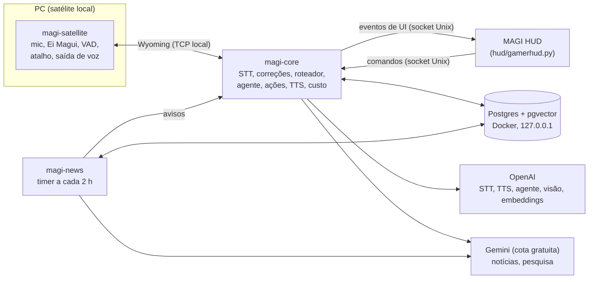
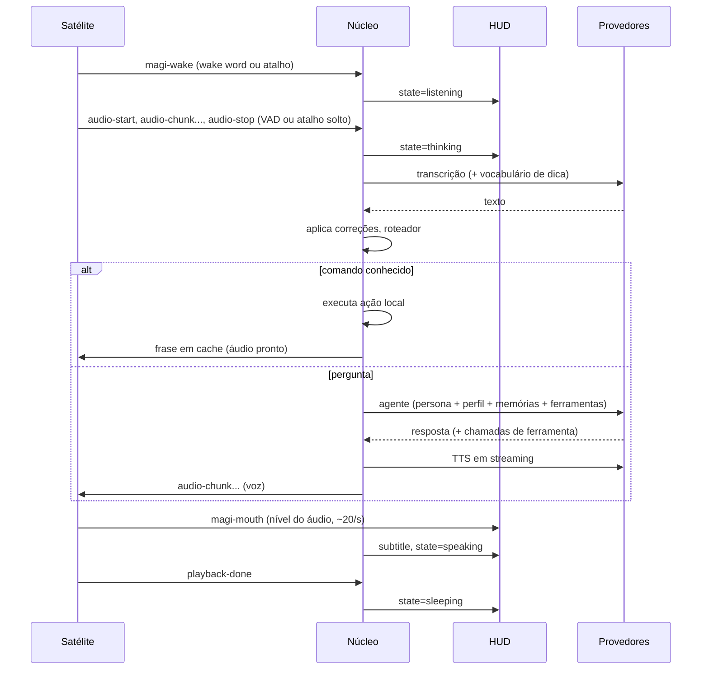

# Design — Magui (MVP)

Implementa [requirements.md](requirements.md). Decisões de produto em [docs/PRD.md](../../docs/PRD.md).

## 1. Visão geral

Três processos Python novos e o HUD existente, todos como serviços do usuário (systemd `--user`),
mais um Postgres com pgvector em Docker.



| Processo | Papel | Fica ligado? |
| --- | --- | --- |
| `magi-satellite` | Captura do microfone, "Ei Magui" (openWakeWord), VAD, atalho, reprodução da voz, nível da boca, tom da voz para o humor | Sempre (é o único custo ocioso) |
| `magi-core` | Todo o resto do turno; dorme em `await` sem custo de CPU | Sempre, ocioso |
| `magi-news` | Coleta e classificação de notícias | Só durante a execução do timer |
| HUD | Mostra rosto, legenda, estados, cards, termômetro | Quando aberto (já existe) |
| Postgres | Memória, histórico, notícias, custo | Sempre, com memória limitada |

**Por que separar satélite e núcleo (Req. 22):** o núcleo nunca toca em áudio; um Raspberry Pi
depois roda só o satélite e fala o mesmo protocolo.

## 2. Stack

| Camada | Escolha | Observação |
| --- | --- | --- |
| Python | 3.12 via `uv` (venv do projeto) | O sistema tem 3.14; várias libs de áudio/ONNX ainda não têm wheel para 3.14 |
| Async | `asyncio` | Um loop por processo |
| Protocolo satélite | `wyoming` (eventos `audio-start/chunk/stop`, `transcript`, `synthesize`) + eventos próprios `magi-*` | Padrão dos satélites do Home Assistant |
| Wake word | `openwakeword` (ONNX, CPU) | Modelo customizado "ei magui" treinado com ~50 amostras + sintéticas |
| VAD | Silero VAD (ONNX) | Fim de fala após 700 ms de silêncio |
| Áudio | `sounddevice` sobre PipeWire; `pulsectl` (pipewire-pulse) para volume, ducking e mudo do Discord | Validar `pipewire-pulse` no spike S1 |
| Agente | `langgraph` + `langchain-openai` + `langchain-google-genai` | Só o agente usa LangChain; roteador e áudio ficam fora |
| Banco | `pgvector/pgvector:pg16` em Docker Compose, `psycopg` 3 | `shared_buffers=32MB`, `max_connections=10` para caber no RNF-02 |
| Fuzzy match | `rapidfuzz` | Roteador e nomes de jogos |
| Spotify | MPRIS via `dbus-next`; Web API via `spotipy` (OAuth PKCE) | |
| Segredos | `keyring` (Secret Service do KDE) | |
| Config | TOML em `~/.config/magi/config.toml` | Recarrega ao salvar (inotify) |

## 3. Turno de voz



### 3.1 Estados do núcleo

`sleeping → listening → thinking → (confirming) → speaking → sleeping`. Interrupção: `magi-wake`
durante `speaking` corta a reprodução (Req. 12.5). Estado `confirming` espera "confirma" por 8 s
(Req. 5.4) com uma nova escuta curta, sem precisar de "Ei Magui".

### 3.2 Discord (Req. 2)

- Detecção de call: `pulsectl` lista `source-output`s; call ativa = fluxo de captura cujo
  `application.process.binary` contém `Discord` (ou `WEBRTC VoiceEngine`) e não está em pausa.
  Verificação a cada 2 s, só no satélite.
- Em call: satélite desliga o openWakeWord (economiza CPU também).
- Atalho em call: satélite muta só o `source-output` do Discord (`set_mute`) e guarda o id em
  `$XDG_RUNTIME_DIR/magi/discord-muted`; ao soltar desmuta. Na inicialização, se o arquivo existir,
  desmuta e apaga (Req. 2.4).

### 3.3 Atalho de apertar pra falar (Req. 1.3–1.4, 1.7)

- Teclado: atalho global do KDE (KGlobalAccel) registrado pelo satélite; usa os sinais
  `globalShortcutPressed` e `globalShortcutReleased` do componente. Tecla padrão: **Pause** (decidida pelo usuário; tecla única, sem modificador, para o jogo não perder o foco). Obs. do S2: argumentos `a(ai)` do KGlobalAccel levam sempre 4 inteiros.
- DualSense: leitura do evdev do controle (`python-evdev`). Exige o usuário no grupo `input` ou
  uma regra udev `uaccess`; decisão no spike S2.

## 4. Núcleo (`magi-core`)

### 4.1 Módulos

| Módulo | Responsabilidade | Requisitos |
| --- | --- | --- |
| `stt` | Transcrição com vocabulário de dica (prompt do modelo de transcrição, ≤200 tokens) | 3 |
| `corrections` | Pares ouvido→certo; aplica por substituição com fronteira de palavra + fuzzy em frases curtas | 3.3–3.4 |
| `router` | Intenções locais em YAML; normalização + `rapidfuzz`; slots (jogo, volume, cor) | 4 |
| `actions` | Steam, HUD, volume, OpenRGB, Spotify, sistema | 5, 6, 7 |
| `agent` | Grafo LangGraph com ferramentas; monta o prompt | 9–14 |
| `persona` | Prompt fixo da persona (~500 tokens) e regras de tom por nível de humor | 13 |
| `mood` | Estimativa 0–4 a partir de sinais locais | 13 |
| `memory` | Perfil compacto, memórias, histórico, "esquece isso" | 11 |
| `help` | Histórico de ajuda por jogo/trecho e degraus | 14 |
| `budget` | Custo por chamada, teto, bloqueio | 16 |
| `providers` | Registro de provedores por tarefa e rodízio de chaves | 21 |
| `tts` | TTS em streaming + cache de frases | 12 |
| `proactive` | Alertas de sensores, bateria, custo, notícias "bomba", sugestão de música | 15, 19.5 |
| `hud_bridge` | Socket Unix com o HUD | 6, 17 |

### 4.2 Roteador (Req. 4)

- Intenções em `magi/core/intents.yaml`: `id`, frases-modelo, slots, `danger: bool`, frase de resposta em cache.
- Pipeline: minúsculas, sem acento, correções aplicadas → para cada intenção, maior
  `rapidfuzz.fuzz.token_set_ratio` entre o texto e as frases-modelo (com o slot removido) → slot
  resolvido contra o catálogo (jogos instalados lidos dos `appmanifest_*.acf` + apelidos aprendidos).
- Limiares iniciais: executar ≥ 88; perguntar "você quis dizer X?" entre 72 e 88; abaixo vai ao agente.
  Ajustáveis em config e calibrados com o conjunto de frases de teste (§10).

### 4.3 Agente (Req. 9–14)

Grafo LangGraph de um nó de modelo + nó de ferramentas (padrão ReAct), no máximo 4 passos.

**Prompt** (limite de 1.500 tokens, verificado antes de cada chamada — Req. 11.3):

| Parte | Tamanho |
| --- | --- |
| Persona e regras | ~500 |
| Perfil compacto | ≤ 300 |
| Nível de humor + instrução de tom | ~40 |
| Contexto do jogo (nome, gênero, tempo de sessão, degrau de ajuda) | ~80 |
| Até 5 memórias por similaridade | ≤ 400 |
| Últimos 2 turnos | ≤ 180 |

**Ferramentas:** `open_game`, `close_game` (perigosa), `hud`, `volume`, `rgb`, `spotify_play`,
`spotify_control`, `spotify_pick` ("coloca uma boa"), `screenshot` (`window` | `screen`),
`web_search` (Gemini + busca do Google), `news_query`, `memory_forget`, `set_budget`,
`help_step` (registra o degrau dado).

Ferramentas perigosas não executam direto: devolvem `needs_confirmation` e o núcleo entra em `confirming`.

### 4.4 Humor (Req. 13)

- Sinais locais por turno: energia RMS e taxa de fala (do satélite), palavrões e frases curtas (texto),
  minutos travados (`help`), horário, reação à última zoeira ("kkk" / "para").
- Nota = média ponderada mapeada para 0–4, suavizada (média móvel exponencial, α=0,3).
  "Pega leve" fixa em 0–1 e "pode pegar pesado" em 3–4 por 30 min, e ajusta os pesos.
- O nível entra no prompt; o HUD recebe `magi-mood`.

### 4.5 Ajuda no jogo (Req. 14)

Tabela `help_log(game, topic, step, at)`. `topic` = resumo canônico do trecho gerado pelo agente
(ex.: "concierge boss"), comparado por similaridade com os anteriores do mesmo jogo.
"Travado": mesmo tópico pedido de novo em menos de 2 h, ou conquistas da Steam sem mudança há
mais de 60 min de sessão.

### 4.6 Custo (Req. 16)

Cada chamada registra `costs(provider, task, model, input_units, output_units, usd, at)` com a
tabela de preços da config. O teto é checado antes de chamadas do agente, da visão e da pesquisa paga.
Transcrição e TTS registram custo, mas não são bloqueadas.

### 4.7 Provedores e chaves (Req. 21)

```toml
# ~/.config/magi/config.toml (trecho)
[providers.openai]
keys = ["openai-1", "openai-2"]        # nomes no keyring, não as chaves

[providers.gemini]
keys = ["gemini-1", "gemini-2"]
free_tier = true                        # proíbe dados pessoais

[tasks]
stt        = { provider = "openai", model = "<modelo de transcrição>" }
tts        = { provider = "openai", model = "<modelo de voz>", voice = "<voz feminina>" }
agent      = { provider = "openai", model = "<modelo pequeno>" }
vision     = { provider = "openai", model = "<modelo com visão>" }
embeddings = { provider = "openai", model = "<modelo de embeddings>" }
search     = { provider = "gemini", model = "<modelo com busca>" }
news       = { provider = "gemini", model = "<modelo rápido>" }

[budget]
monthly_usd = 5.0
```

- `KeyPool` por provedor: rodízio; em 429/401/403 marca a chave em espera (60 s, dobrando até 1 h) e tenta a próxima.
- Um provedor com `free_tier = true` recusa chamadas marcadas como `personal=True` (memória, voz, humor, capturas) — Req. 21.5.
- Os modelos ficam fora do código; a escolha final é feita no spike S3, medindo latência e custo.

## 5. Satélite (`magi-satellite`)

- Captura contínua a 16 kHz mono em blocos de 80 ms; openWakeWord roda em cada bloco (único custo ocioso).
- Após ativação: VAD Silero define o fim de fala; os blocos vão ao núcleo pelo Wyoming.
- Reprodução: recebe áudio TTS, toca pelo PipeWire e emite `magi-mouth` com RMS normalizado a cada 50 ms
  (o HUD mapeia < 0,15 → "—", < 0,5 → "o", resto → "O").
- Ducking: durante a reprodução, reduz para 30% os `sink-input`s do Spotify e do jogo atual; restaura ao fim.
- Mede energia e taxa de fala do turno (para o humor) e envia como metadado no `audio-stop`.

## 6. Integração com o HUD

Socket Unix `$XDG_RUNTIME_DIR/magi/hud.sock`, mensagens JSON por linha.

| Direção | Mensagem | Uso |
| --- | --- | --- |
| núcleo → HUD | `{"t":"state","v":"listening"}` | Expressão do rosto e estados |
| núcleo → HUD | `{"t":"subtitle","text":"…","full":"…"}` | Legenda e resposta completa |
| satélite → HUD | `{"t":"mouth","v":0.42}` | Boca (via núcleo, para um único socket) |
| núcleo → HUD | `{"t":"mood","v":2}` | Termômetro |
| núcleo → HUD | `{"t":"vote","verdict":"pending/approved/denied"}` | Votação dos MAGI |
| núcleo → HUD | `{"t":"card","level":"alta","title":"…","url":"…"}` | Cards de notícia e links |
| HUD → núcleo | `{"t":"cmd","name":"push_to_talk"}` | Futuro: clicar no rosto para falar |

- O HUD ganha um módulo `face` que desenha o rosto em caracteres. Acordado, só a região do rosto
  é redesenhada a até 30 fps (mesmo esquema de cache do HUD); dormindo, só a cada 4 s.
- Controle do HUD pelo núcleo: reaproveita os mecanismos existentes (`settings.json`, `gamerhud`,
  `magi-view.py`, `--toggle-rgb`); detalhes de CPU/GPU/memória ganham um comando no socket.

## 7. Dados (Postgres + pgvector)

```sql
-- conversa e aprendizado
turns(id, at, satellite, text_heard, text_final, intent, routed_local bool, reply, mood, cost_usd)
corrections(id, heard, correct, uses, created_at)
vocab(term, kind, weight)                      -- gírias, nomes, apelidos
profile(id=1, body text, updated_at)           -- perfil compacto (≤ 300 tokens)
memories(id, kind, body, embedding vector(1536), turn_id, created_at)
help_log(id, game_appid, topic, step, at)
mood_events(id, at, signal, value)
costs(id, at, provider, task, model, input_units, output_units, usd)

-- música
music_signals(id, at, track_uri, artist, context jsonb, signal smallint)   -- -1, +1, +2, -99 (nunca)
taste(artist, genre, weight)

-- notícias
news_sources(id, name, kind, url, trust smallint)                   -- trust 1..3
news_raw(id, source_id, url unique, title, body, published_at, fetched_at)
news_items(id, title, summary, embedding vector(768), first_seen, sources int,
           max_trust, franchise, kind, spoiler jsonb, priority real, level text, delivered_at)
news_item_sources(item_id, raw_id)
franchise_prefs(franchise, weight, dropped bool, spoilers_ok bool)
progress(franchise, kind, value, updated_at)                          -- episódio visto, horas jogadas
news_feedback(item_id, at, signal)
```

Índices HNSW em `memories.embedding` e `news_items.embedding`. A dimensão real dos vetores segue
o modelo de embeddings configurado (a tabela é criada pela migração com o valor da config).

## 8. Notícias (`magi-news`)

Timer systemd a cada 2 h (`Persistent=true`). Uma execução:

1. **Coletar:** feeds RSS (`feedparser`), Steam `ISteamNews/GetNewsForApp` para os jogos instalados,
   AniList GraphQL (temporadas e sequências das obras da minha lista), Reddit JSON com OAuth.
   Scraping (`httpx` + `selectolax`) só para fontes marcadas `kind=scrape`, checando `robots.txt`
   e 1 req/s por domínio. Deduplicação exata por URL.
2. **Agrupar:** embedding do título + lead (Gemini); junta a um item existente das últimas 72 h se
   cosseno ≥ 0,88, senão cria item.
3. **Classificar** em lote (Gemini, saída JSON com esquema): franquia, tipo (anúncio, data, trailer,
   temporada, rumor, review, outro), spoiler (sim/não, de quê), "tamanho do fato" 0–1, manchete segura.
   Prompt fixo + até 6 exemplos tirados do meu retorno recente.
4. **Pontuar:** `priority = 0,45·gosto + 0,25·tamanho + 0,15·confiança + 0,15·novidade`,
   com `gosto` vindo de `franchise_prefs` (Steam mais jogados, lista de anime, retorno).
   Obras largadas → descartadas. Níveis: bomba ≥ 0,85 **e** ≥ 2 fontes com uma de confiança 3;
   alta ≥ 0,65; normal ≥ 0,4; abaixo, guardada.
5. **Entregar:** bomba e alta são enviadas ao núcleo (`proactive`), que decide voz ou card conforme
   call e jogo. Normal fica para "novidades?".
6. **Cota esgotada:** os passos 2–3 param e o item fica pendente para a próxima execução (Req. 18.6).

## 9. Erros e degradação

| Falha | Comportamento |
| --- | --- |
| Sem internet | Frase em cache "tô sem internet"; wake word e áudio continuam locais |
| Chave com limite/erro | Próxima chave do pool; todas indisponíveis → avisa e desiste do turno |
| Teto atingido | Agente, visão e pesquisa paga recusam com frase em cache; comandos locais seguem |
| Postgres fora | Núcleo funciona sem memória (perfil em cache local); avisa uma vez |
| Spotify fechado | Abre e repete o pedido (até 15 s) |
| OpenRGB fora | Avisa que RGB está indisponível |
| HUD fechado | Mensagens de UI descartadas; voz continua |
| Satélite caiu | systemd reinicia; Discord desmutado na inicialização |

## 10. Testes

| Tipo | O quê |
| --- | --- |
| Unitário | Roteador (limiares, slots), correções, `KeyPool`, orçamento, nota de prioridade, regras de spoiler e níveis, mapeamento da boca |
| Frases de ouro | `tests/data/utterances.yaml`: frases reais minhas (inclusive enroladas) → intenção esperada; mede o acerto do RNF-07 |
| Integração | Provedores falsos (sem rede) para o turno completo; Postgres de teste em Docker |
| Desempenho | Script que mede CPU/RAM do satélite + núcleo + Postgres ociosos por 10 min (RNF-01/02) e latência p90 de 50 turnos (RNF-04/05) |
| Manual | Falsos disparos: 1 h de jogo com Discord, contando ativações (RNF-06) |

## 11. Estrutura do repositório

```
magi-assistant-ai/
  docs/PRD.md
  docs/spikes/             # resultados S1–S4
  docs/perf/               # medições dos RNF
  specs/magi-assistant/{requirements,design,tasks}.md
  hud/                     # MAGI Gamer (existente) + face e hud_bridge novos
  spikes/                  # código descartável dos spikes
  tools/                   # perf.py e utilitários
  magi/
    cli/                   # magi-keys, login do Spotify
    common/                # config, keyring, contratos, protocolo de eventos
    satellite/             # captura, wake, VAD, PTT, reprodução, Discord
    core/                  # turno, stt, corrections, router, actions, tts, budget, proactive
    agent/                 # grafo, persona, ferramentas
    memory/                # repositórios Postgres, perfil, humor, ajuda
    news/                  # coletores, agrupamento, classificação, pontuação
    providers/             # registro por tarefa, KeyPool
  deploy/
    docker-compose.yml     # pgvector
    systemd/               # magi-satellite, magi-core, magi-news (.service/.timer)
  tests/
  pyproject.toml           # uv, Python 3.12
```

## 12. Spikes antes da fase 1

| Spike | Pergunta | Saída |
| --- | --- | --- |
| S1 | `sounddevice` + `pulsectl` funcionam no PipeWire do Nobara (captura, ducking, mudo do Discord)? | Script de prova + decisão |
| S2 | Atalho: KGlobalAccel entrega pressionar e soltar? DualSense via evdev precisa do grupo `input`? | Escolha do mecanismo de PTT |
| S3 | Quais modelos da OpenAI e do Gemini atendem latência e custo (transcrição PT-BR, TTS feminina, agente, pesquisa)? | Valores para `[tasks]` |
| S4 | openWakeWord com "Ei Magui": quantas amostras para ≤ 1 falso disparo/h? | Modelo `ei_magui.onnx` |

## 13. Interface "wired" (R23)

Fonte visual: `docs/design/MAGI-HANDOFF.md` e `docs/design/wired/{Main,Standby}.dc.html` (só referência; o runtime `.dc` não é usado). Onde o handoff conflita com este SDD, vale o SDD:

| Handoff | Decisão no SDD |
| --- | --- |
| HTML/SVG | QPainter raster no `gamerhud.py` (sem GPU); grade lógica 1920×1080 com `painter.scale(4/3)` |
| Spotify pela Web API (polling, controles com Premium) | MPRIS local para metadados, capa (`mpris:artUrl`), posição e controles; Web API só se um dia houver "a seguir" |
| Mascote estático | Mascote vetorial com as 7 expressões do R17 e boca por nível de áudio (`magi-mouth`) |
| Valores simulados | Dados reais; "– –" quando não houver |

Módulos novos em `hud/wired/` (o `gamerhud.py` só escolhe o tema e repassa eventos):

- `theme.py`: tokens do handoff e tingimento pelo LED (`rgb+88` borda, `rgb+14` fundo).
- `fonts.py` + `hud/fonts/`: Shippori Mincho, Barlow Condensed, JetBrains Mono, Zen Kaku Gothic New (OFL), carregadas pelo `QFontDatabase`.
- `kit.py`: painel chanfrado (14 px), traço 56×3, scanlines em pixmap, barras de segmentos (warn/hot), sparklines, rótulos.
- `scene.py`: cenário de fios/postes/prédios em pixmap cacheado por tamanho.
- `mascot.py`: mascote (parênteses, olhos, rubor, boca), expressões, piscar, "zz".
- `data.py`: rede (`/proc/net/dev`), histórico de carga (amostra a cada 30 s, 120 pontos), FPS mín/méd/máx, Spotify via MPRIS (QtDBus) com cache de capa, log de eventos do rodapé.
- `main_screen.py` e `standby_screen.py`: composição das telas; camadas estáticas em cache e redesenho por região (relógio 1 Hz, dados 1 Hz, mascote até 30 fps só quando acordada).

Tema escolhido por `ui = "wired" | "eva"` no `settings.json` do HUD (padrão `wired`).
